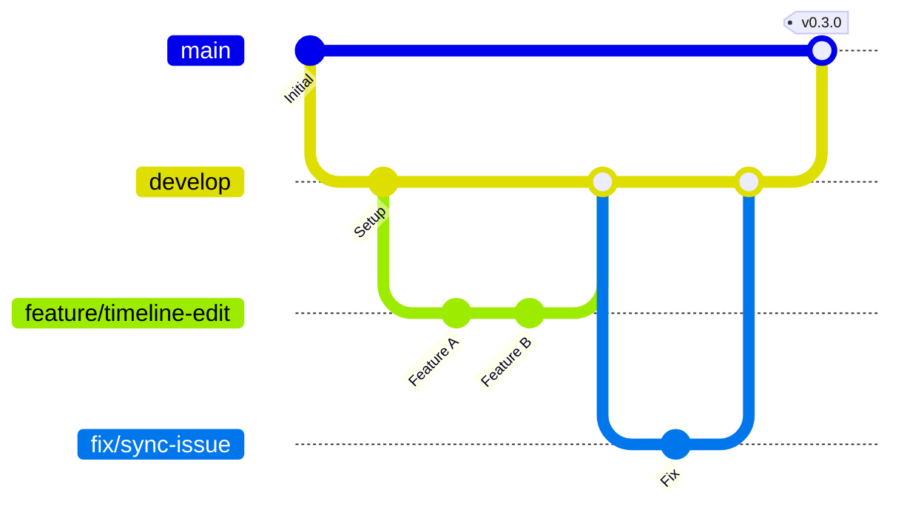

# Git Flow ワークフロー詳細

このドキュメントでは、SporTagLytics プロジェクトで採用している Git Flow ブランチモデルの詳細を説明します。

---

## 目次

1. [ブランチ構成](#ブランチ構成)
2. [ブランチの役割](#ブランチの役割)
3. [開発フロー詳細](#開発フロー詳細)
4. [禁止事項](#禁止事項)
5. [トラブルシューティング](#トラブルシューティング)

---

## ブランチ構成



---

## ブランチの役割

### `main` (本番ブランチ)

- **目的**: 本番環境にデプロイ可能な安定版のみを保持
- **特徴**:
  - リリースタグ（例: `v0.3.0`）が付けられた状態のコードのみ
  - 直接コミット **禁止**
  - `develop` からのマージのみ許可
- **保護設定**: GitHub の Branch Protection Rules が有効

### `develop` (開発ブランチ)

- **目的**: 次期リリース向けの統合ブランチ
- **特徴**:
  - すべての作業ブランチのマージ先
  - CI/CD で継続的にテストを実行
  - 常にビルド可能な状態を維持
- **保護設定**: プルリクエスト必須、レビュー承認後にマージ

### `feature/*` (機能開発ブランチ)

- **目的**: 新機能の開発
- **派生元**: `develop`
- **マージ先**: `develop`
- **命名規則**: `feature/説明的な名前`
  - 例: `feature/custom-code-layout`
  - 例: `feature/audio-sync-improvement`
- **ライフサイクル**: 機能完成後に削除

### `fix/*` (バグ修正ブランチ)

- **目的**: バグの修正
- **派生元**: `develop`（緊急の場合は `main` も可）
- **マージ先**: `develop`（緊急の場合は `main` と `develop` 両方）
- **命名規則**: `fix/issue-番号-説明` または `fix/説明`
  - 例: `fix/issue-42-timeline-save-error`
  - 例: `fix/audio-sync-crash`

### `docs/*` (ドキュメント変更ブランチ)

- **目的**: ドキュメントのみの変更
- **派生元**: `develop`
- **マージ先**: `develop`
- **命名規則**: `docs/説明`
  - 例: `docs/update-readme`
  - 例: `docs/add-architecture-diagram`

### `refactor/*` / `test/*` (その他の作業ブランチ)

- **派生元**: `develop`
- **マージ先**: `develop`
- **命名規則**: `refactor/説明`、`test/説明`

---

## 開発フロー詳細

### 1. 新機能開発

```bash
# 1. developを最新化
git checkout develop
git pull origin develop

# 2. feature ブランチ作成
git checkout -b feature/custom-code-layout

# 3. 開発・コミット
# ... コーディング ...
git add .
git commit -m "feat: カスタムコードレイアウト機能を追加"

# 4. 追加の変更
# ... さらに開発 ...
git add .
git commit -m "feat: レイアウト設定の永続化を実装"

# 5. pushとPR作成
git push origin feature/custom-code-layout
# GitHubでdevelopへのPR作成

# 6. レビュー・マージ後、ブランチ削除
git checkout develop
git pull origin develop
git branch -d feature/custom-code-layout
```

### 2. バグ修正

```bash
# 1. Issue番号を確認（例: #42）
# 2. developから派生
git checkout develop
git pull origin develop
git checkout -b fix/issue-42-timeline-save-error

# 3. 修正・テスト
# ... バグ修正 ...
git add .
git commit -m "fix: タイムライン保存時のエラーを修正 (#42)"

# 4. push と PR作成
git push origin fix/issue-42-timeline-save-error
# GitHubでdevelopへのPR作成（#42へのリンクを含める）

# 5. マージ後、ブランチ削除
git checkout develop
git pull origin develop
git branch -d fix/issue-42-timeline-save-error
```

### 3. ドキュメント更新

```bash
# 小規模な修正の場合
git checkout develop
git pull origin develop
git checkout -b docs/update-readme

# ... ドキュメント編集 ...
git add .
git commit -m "docs: READMEの使用方法を更新"
git push origin docs/update-readme
# GitHubでPR作成
```

### 4. リリース（メンテナのみ）

```bash
# 1. developの内容を検証
# - すべてのテストがパス
# - ドキュメントが最新
# - CHANGELOGが更新済み

# 2. package.jsonのバージョン更新
# developブランチで実施
git checkout develop
# package.jsonのバージョンを更新（例: 0.2.2 → 0.3.0）
git add package.json
git commit -m "chore: bump version to 0.3.0"
git push origin develop

# 3. develop → main PR作成
# GitHubでdevelopからmainへのPRを作成
# タイトル: "Release v0.3.0"
# 本文: CHANGELOGの内容を含める

# 4. PR承認・マージ後、タグ作成
git checkout main
git pull origin main
git tag v0.3.0
git push origin v0.3.0

# 5. GitHub Actionsが自動ビルド・リリース作成
# - .github/workflows/build-release.ymlが実行
# - macOS/Windows向けバイナリがビルド
# - GitHubリリースページに公開
```

---

## 禁止事項

以下の行為は Git Flow の原則に反するため **禁止** です：

### ❌ `main` への直接コミット

```bash
# 絶対にこれをしないこと
git checkout main
git commit -m "..." # ❌ 禁止
```

**理由**: `main` は安定版のみを保持すべきブランチです。

### ❌ `develop` への直接コミット（例外を除く）

```bash
# プルリクエストを経由せずにコミット
git checkout develop
git commit -m "..." # ⚠️ 基本的に禁止
```

**例外**: 緊急の README 修正など、極めて小規模な変更のみ

### ❌ 作業ブランチから別の作業ブランチへのマージ

```bash
# 間違った例
git checkout feature/branch-a
git merge feature/branch-b # ❌ 禁止
```

**理由**: ブランチ間の依存関係が複雑化します。必ず `develop` を経由してください。

### ❌ レビューなしのマージ

```bash
# GitHubでPR作成後、レビューなしでマージボタンを押す # ❌ 禁止
```

**理由**: コード品質とナレッジ共有のため、最低1名のレビューが必要です。

### ❌ 古い `develop` からのブランチ作成

```bash
# 数日前にdevelopをpullしたまま、新しいブランチを作成
git checkout develop
# ... 数日経過 ...
git checkout -b feature/new-feature # ⚠️ 危険
```

**影響**: 他の人の変更と競合し、マージ時にコンフリクトが発生します。

**正しい手順**:

```bash
git checkout develop
git pull origin develop # 必ず最新化
git checkout -b feature/new-feature
```

---

## トラブルシューティング

### Q1: `develop` が古い状態でブランチを作成してしまった

**解決方法**: `rebase` で最新の `develop` を取り込む

```bash
git checkout develop
git pull origin develop
git checkout your-branch
git rebase develop

# コンフリクトが発生した場合
# 1. コンフリクトを解決
# 2. git add <解決したファイル>
# 3. git rebase --continue
```

### Q2: 誤って `main` に PR を作成してしまった

**解決方法**: GitHub UI でベースブランチを変更

1. PR ページを開く
2. タイトル横の「Edit」ボタンをクリック
3. ベースブランチを `main` → `develop` に変更
4. 保存

### Q3: コミットメッセージを間違えた（まだ push していない）

**解決方法**: `git commit --amend` で修正

```bash
# 直前のコミットメッセージを修正
git commit --amend -m "正しいメッセージ"
```

### Q4: 誤って `develop` に直接コミットしてしまった（まだ push していない）

**解決方法**: コミットを取り消して作業ブランチに移動

```bash
# 1. コミットを取り消し（変更は保持）
git reset HEAD~1

# 2. 新しいブランチを作成
git checkout -b feature/proper-branch

# 3. 再度コミット
git add .
git commit -m "適切なメッセージ"
```

### Q5: マージコンフリクトが発生した

**解決方法**: ローカルで `develop` をマージして解決

```bash
# 1. developを最新化
git checkout develop
git pull origin develop

# 2. 作業ブランチに戻る
git checkout your-branch

# 3. developをマージ
git merge develop

# 4. コンフリクトを解決
# - VSCodeなどでコンフリクトマーカーを編集
# - 正しい内容を選択・統合

# 5. 解決後、コミット
git add .
git commit -m "merge: resolve conflicts with develop"

# 6. push
git push origin your-branch
```

### Q6: プルリクエストが古くなった（他の PR が先にマージされた）

**解決方法**: 最新の `develop` を取り込む

```bash
git checkout develop
git pull origin develop
git checkout your-branch
git merge develop  # または git rebase develop
git push origin your-branch
```

---

## 参考資料

- **基本的な開発手順**: [CONTRIBUTING.md](../CONTRIBUTING.md)
- **開発環境セットアップ**: [DEVELOPMENT.md](../DEVELOPMENT.md)
- **アーキテクチャ**: [ARCHITECTURE.md](../ARCHITECTURE.md)
- **Git Flow 公式**: [nvie.com/posts/a-successful-git-branching-model](https://nvie.com/posts/a-successful-git-branching-model/)

---

## フィードバック

このワークフローに関して質問や改善提案がある場合は、Issue を作成してください。
