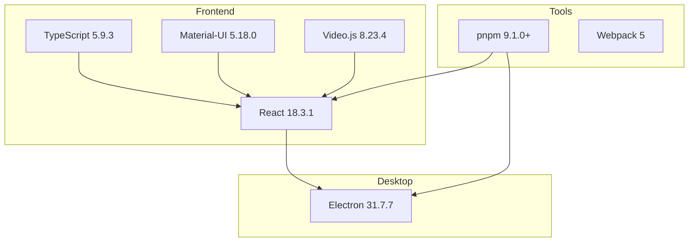
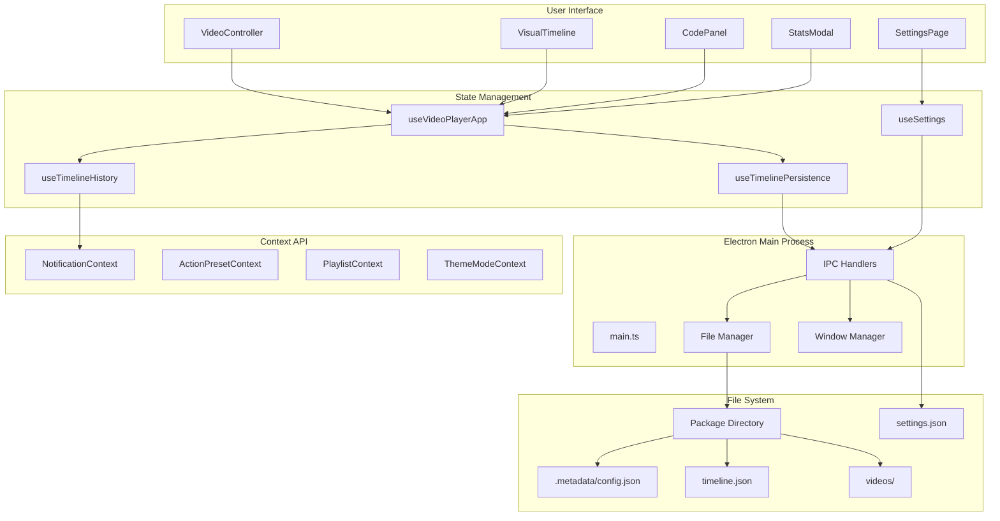
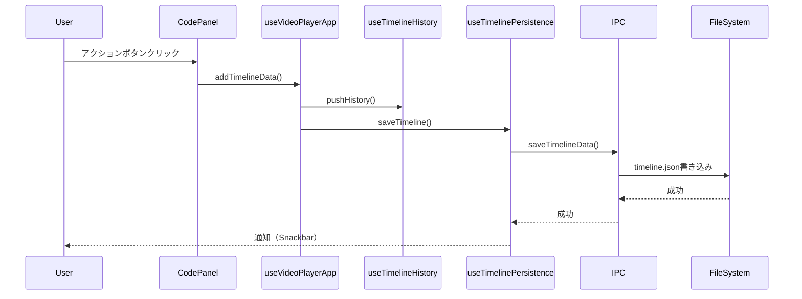
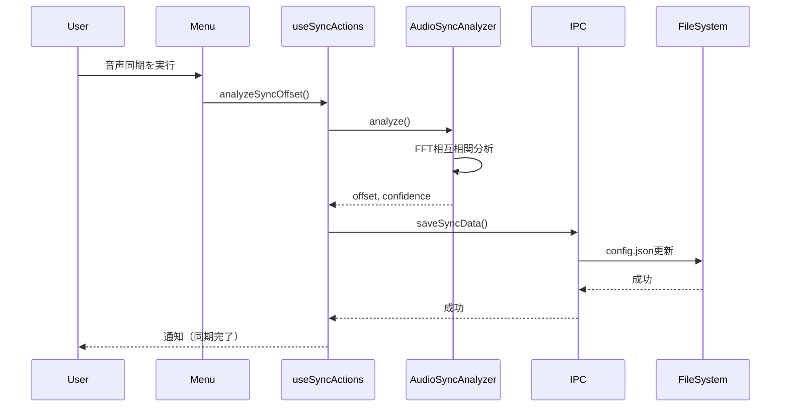

# アーキテクチャ

> **関連ドキュメント**  
> [DEVELOPMENT.md](DEVELOPMENT.md) | [CONTRIBUTING.md](CONTRIBUTING.md) | [.github/copilot-instructions.md](.github/copilot-instructions.md)

このドキュメントは、SporTagLyticsのシステム設計、技術選定理由、アーキテクチャの詳細を説明します。

---

## 目次

1. [プロジェクト概要](#プロジェクト概要)
2. [技術スタックと選定理由](#技術スタックと選定理由)
3. [アーキテクチャ概要](#アーキテクチャ概要)
4. [データフロー](#データフロー)
5. [ディレクトリ構成と責務](#ディレクトリ構成と責務)
6. [主要コンポーネント](#主要コンポーネント)
7. [状態管理戦略](#状態管理戦略)
8. [IPC通信パターン](#ipc通信パターン)
9. [設計原則](#設計原則)
10. [パフォーマンス最適化](#パフォーマンス最適化)

---

## プロジェクト概要

SporTagLyticsは、スポーツ映像（特にラグビー）の分析を支援するElectronベースのデスクトップアプリケーションです。

### 目的

- 映像の特定の瞬間にイベントをタグ付け
- 統計分析による戦術理解の向上
- チーム/個人のパフォーマンス可視化

### 対象ユーザー

- スポーツアナリスト
- コーチ・監督
- 選手
- ビデオ分析担当者

---

## 技術スタックと選定理由



| 技術            | バージョン | 選定理由                                                                           |
| --------------- | ---------- | ---------------------------------------------------------------------------------- |
| **React**       | 18.3.1     | - 関数コンポーネント+Hooksの成熟度<br>- 豊富なエコシステム<br>- 開発効率の高さ     |
| **TypeScript**  | 5.9.3      | - 型安全性による早期バグ検出<br>- IDEサポートの充実<br>- 大規模アプリの保守性向上  |
| **Electron**    | 31.7.7     | - クロスプラットフォーム対応<br>- ファイルシステムアクセス<br>- ネイティブ機能統合 |
| **Material-UI** | 5.18.0     | - 一貫性のあるデザインシステム<br>- アクセシビリティ対応<br>- カスタマイズ性       |
| **Video.js**    | 8.23.4     | - HTML5ビデオプレイヤーの標準<br>- プラグイン豊富<br>- 安定性                      |
| **pnpm**        | 9.1.0+     | - 高速インストール<br>- 厳密な依存関係管理<br>- ディスク効率                       |

---

## アーキテクチャ概要

### システム構成図



### レイヤー構成

1. **プレゼンテーション層** (UI Components)
   - React関数コンポーネント
   - Material-UI
   - View/ロジックの分離

2. **アプリケーション層** (Custom Hooks)
   - ビジネスロジック
   - 状態管理
   - 副作用処理

3. **データアクセス層** (IPC + File System)
   - Electron IPCハンドラー
   - ファイルI/O
   - 設定永続化

---

## データフロー

### タイムラインデータのライフサイクル



### 音声同期のフロー



---

## ディレクトリ構成と責務

### src/ (Reactアプリケーション)

```
src/
├── features/                      # 機能単位のモジュール
│   ├── playlist/                  # プレイリスト機能
│   │   ├── PlaylistWindowApp.tsx # プレイリストウィンドウ
│   │   ├── components/            # プレイリスト専用UI
│   │   └── hooks/                 # プレイリストロジック
│   └── videoPlayer/               # ビデオプレイヤー機能（メイン）
│       ├── analysis/              # 統計分析ロジック
│       │   ├── hooks/             # 分析用カスタムフック
│       │   │   ├── useActionBreakdown.ts
│       │   │   ├── useMatrixAxes.ts
│       │   │   └── useMatrixFilters.ts
│       │   └── utils/             # 分析ユーティリティ
│       │       └── matrixBuilder.ts
│       └── components/            # UIコンポーネント
│           ├── Analytics/         # 統計モーダル
│           │   └── StatsModal/
│           │       ├── StatsModal.tsx
│           │       └── view/      # 各分析ビュー
│           ├── Controls/          # コントロールパネル
│           │   ├── EnhancedCodePanel/
│           │   └── VideoController/
│           ├── Player/            # プレイヤー本体
│           │   ├── SingleVideo/
│           │   └── SyncedVideo/
│           ├── Setup/             # 初期設定
│           │   └── VideoPathSelector/
│           │       ├── components/
│           │       ├── hooks/
│           │       └── steps/
│           └── Timeline/          # タイムライン
│               └── VisualTimeline/
│                   ├── VisualTimeline.tsx
│                   └── hooks/     # タイムライン用フック
│                       ├── useTimelineViewport.ts
│                       ├── useTimelineInteractions.ts
│                       ├── useTimelineEditDraft.ts
│                       ├── useTimelineValidation.ts
│                       └── useTimelineRangeSelection.ts
├── pages/                         # ページコンポーネント
│   ├── settings/                  # 設定画面
│   │   └── components/
│   ├── videoPlayer/               # ビデオプレイヤーページ
│   │   ├── components/
│   │   └── hooks/
│   ├── SettingsPage.tsx
│   └── VideoPlayerApp.tsx         # メインページ
├── hooks/                         # 共通カスタムフック
│   ├── videoPlayer/               # ビデオプレイヤー用
│   │   ├── useSyncActions.ts
│   │   ├── useTimelineEditing.ts
│   │   ├── useTimelineHistory.ts
│   │   ├── useTimelinePersistence.ts
│   │   └── useTimelineSelection.ts
│   ├── useGlobalHotkeys.ts
│   ├── useSettings.ts
│   └── useVideoPlayerApp.ts       # アプリ全体の状態管理
├── types/                         # 型定義
│   ├── TimelineData.ts
│   ├── Settings.ts
│   ├── MetaData.ts
│   ├── VideoSync.ts
│   └── ...
├── utils/                         # ユーティリティ
│   ├── AudioSyncAnalyzer.ts
│   ├── scTimelineConverter.ts
│   ├── timelineExport.ts
│   └── ...
├── contexts/                      # Context API
│   ├── NotificationContext.tsx
│   ├── ActionPresetContext.tsx
│   ├── PlaylistContext.tsx
│   └── ThemeModeContext.tsx
└── components/                    # 共通コンポーネント
    ├── OnboardingTutorial.tsx
    ├── ShortcutGuide.tsx
    └── QuickHelpFab.tsx
```

### electron/ (Electronアプリケーション)

```
electron/
└── src/
    ├── main.ts                    # エントリーポイント
    ├── preload.ts                 # Context Bridge定義
    ├── menuBar.ts                 # アプリケーションメニュー
    ├── settingsManager.ts         # 設定永続化
    ├── settingsWindow.ts          # 設定ウィンドウ管理
    ├── playlistWindow.ts          # プレイリストウィンドウ管理
    ├── helpWindow.ts              # ヘルプウィンドウ管理
    ├── shortCutKey.ts             # グローバルショートカット
    └── utils.ts                   # ユーティリティ
```

### 責務の原則

1. **features/**: 機能単位で整理、依存は一方向（features → hooks → types）
2. **pages/**: ページ固有のレイアウトとロジック
3. **hooks/**: 複数ページで共有するロジック
4. **components/**: 汎用的なUIコンポーネント
5. **types/**: すべてのモジュールから参照される型定義
6. **electron/**: Electronメインプロセス、IPC、ネイティブ機能

---

## 主要コンポーネント

### コンポーネント一覧

| コンポーネント          | パス                                     | 責務                           |
| ----------------------- | ---------------------------------------- | ------------------------------ |
| **VideoPlayerApp**      | pages/VideoPlayerApp.tsx                 | メインページ、全体のレイアウト |
| **SettingsPage**        | pages/SettingsPage.tsx                   | 設定画面（4タブ）              |
| **SyncedVideoPlayer**   | features/.../Player/SyncedVideo/         | 2映像の同期再生                |
| **VideoController**     | features/.../Controls/VideoController/   | 再生制御UI                     |
| **EnhancedCodePanel**   | features/.../Controls/EnhancedCodePanel/ | コーディングパネル             |
| **VisualTimeline**      | features/.../Timeline/VisualTimeline/    | ビジュアルタイムライン         |
| **StatsModal**          | features/.../Analytics/StatsModal/       | 統計モーダル                   |
| **VideoPathSelector**   | features/.../Setup/VideoPathSelector/    | パッケージ選択                 |
| **CreatePackageWizard** | features/.../Setup/.../                  | パッケージ作成ウィザード       |
| **FreeCanvasEditor**    | pages/settings/.../CodeWindowSettings/   | コードウィンドウ編集           |

### カスタムフック一覧

| フック                      | 責務                                               |
| --------------------------- | -------------------------------------------------- |
| **useVideoPlayerApp**       | アプリ全体の状態管理（timeline, videos, metadata） |
| **useSettings**             | 設定の読み書き（IPC経由）                          |
| **useGlobalHotkeys**        | グローバルホットキー登録                           |
| **useSyncActions**          | 音声同期操作（分析/リセット/手動）                 |
| **useTimelineEditing**      | タイムライン編集操作                               |
| **useTimelineHistory**      | Undo/Redo履歴管理（最大50件）                      |
| **useTimelinePersistence**  | タイムライン自動保存                               |
| **useTimelineSelection**    | タイムライン選択状態                               |
| **useTimelineViewport**     | ズーム・ビューポート計算                           |
| **useTimelineInteractions** | インタラクション処理                               |
| **useTimelineEditDraft**    | 編集ドラフト管理                                   |
| **useTimelineValidation**   | 入力バリデーション                                 |
| **useActionBreakdown**      | アクション分析データ整形                           |
| **useMatrixAxes**           | クロス集計軸管理                                   |
| **useMatrixFilters**        | クロス集計フィルタ                                 |

---

## 状態管理戦略

### useState (ローカル状態)

コンポーネント内部でのみ使用する状態。

```typescript
const [isPlaying, setIsPlaying] = useState(false);
```

### useEffect (副作用)

必ず完全な依存配列とクリーンアップを定義。

```typescript
useEffect(() => {
  const handler = () => {
    /* ... */
  };
  window.addEventListener('resize', handler);
  return () => window.removeEventListener('resize', handler);
}, []);
```

### useMemo / useCallback (メモ化)

計算コストが高い値や、子コンポーネントへの関数渡しで使用。

```typescript
const filteredData = useMemo(
  () => timeline.filter((item) => item.team === selectedTeam),
  [timeline, selectedTeam],
);
```

### Context API (グローバル状態)

アプリ全体で共有する状態。

| Context                 | 用途                       |
| ----------------------- | -------------------------- |
| **NotificationContext** | 通知（Snackbar）の表示管理 |
| **ActionPresetContext** | アクションプリセット管理   |
| **PlaylistContext**     | プレイリスト状態管理       |
| **ThemeModeContext**    | テーマ（Light/Dark）管理   |

### Prop Drilling回避

深い階層への値渡しは、カスタムフックまたはContextで解決。

---

## IPC通信パターン

### Context Bridge (preload.ts)

```typescript
contextBridge.exposeInMainWorld('electronAPI', {
  // ファイル操作
  selectDirectory: () => ipcRenderer.invoke('select-directory'),
  saveTimelineData: (path, data) =>
    ipcRenderer.invoke('save-timeline-data', path, data),
  loadTimelineData: (path) => ipcRenderer.invoke('load-timeline-data', path),

  // 設定管理
  getSettings: () => ipcRenderer.invoke('get-settings'),
  saveSettings: (settings) => ipcRenderer.invoke('save-settings', settings),

  // ウィンドウ管理
  openPlaylistWindow: () => ipcRenderer.invoke('open-playlist-window'),

  // メニュー操作
  onMenuAction: (callback) => ipcRenderer.on('menu-action', callback),
});
```

### IPCハンドラー (main.ts)

```typescript
ipcMain.handle('save-timeline-data', async (event, packagePath, data) => {
  const filePath = path.join(packagePath, 'timeline.json');
  await fs.writeFile(filePath, JSON.stringify(data, null, 2), 'utf-8');
  return { success: true };
});
```

### 使用例 (React側)

```typescript
const saveTimeline = useCallback(async () => {
  try {
    await window.electronAPI.saveTimelineData(packagePath, timeline);
    showNotification('タイムラインを保存しました', 'success');
  } catch (error) {
    showNotification('保存に失敗しました', 'error');
  }
}, [packagePath, timeline]);
```

---

## 設計原則

### 1. 関数コンポーネントのみ

React 18の関数コンポーネント + Hooksを使用し、クラスコンポーネントは使用しない。

### 2. 責務分離

View（JSX）とロジック（Hooks）を明確に分離。

```typescript
// ❌ 悪い例: ロジックがViewに混在
const MyComponent = () => {
  const [data, setData] = useState([]);
  useEffect(() => {
    fetch('/api/data').then(res => res.json()).then(setData);
  }, []);

  return <div>{/* ... */}</div>;
};

// ✅ 良い例: Hookに分離
const useData = () => {
  const [data, setData] = useState([]);
  useEffect(() => {
    fetch('/api/data').then(res => res.json()).then(setData);
  }, []);
  return data;
};

const MyComponent = () => {
  const data = useData();
  return <div>{/* ... */}</div>;
};
```

### 3. 型安全性

TypeScript strict modeを有効化し、`any`の使用を最小化。

```typescript
// ❌ 悪い例
const handleClick = (event: any) => {
  /* ... */
};

// ✅ 良い例
const handleClick = (event: React.MouseEvent<HTMLButtonElement>) => {
  /* ... */
};
```

### 4. Feature-based構造

機能単位でコードを整理し、依存関係を明確化。

```
features/videoPlayer/
  ├── components/  # この機能専用のUI
  ├── hooks/       # この機能のロジック
  └── utils/       # この機能のユーティリティ
```

### 5. Material UI標準

UIは`sx`プロパティで統一的にスタイリング。

```typescript
<Box sx={{ p: 2, bgcolor: 'background.paper' }}>
  {/* ... */}
</Box>
```

---

## パフォーマンス最適化

### 1. メモ化

```typescript
const expensiveCalculation = useMemo(() => {
  return timeline.reduce((acc, item) => {
    // 複雑な計算
  }, {});
}, [timeline]);
```

### 2. コンポーネント分割

大きなコンポーネントは小さく分割し、必要な部分のみ再レンダリング。

### 3. 仮想化

長いリスト（タイムライン等）は仮想スクロールを検討（将来対応）。

### 4. デバウンス

頻繁なイベント（入力、スクロール）はデバウンス処理。

```typescript
const debouncedSave = useMemo(
  () => debounce(saveTimeline, 500),
  [saveTimeline],
);
```

### 5. Code Splitting

現在は未実装だが、将来的にReact.lazyで遅延ロード。

---

## 技術的負債と将来の改善

### 現状の課題

1. **テストカバレッジ不足**: ユニットテスト・E2Eテストが未整備
2. **型定義の一部any**: 厳密な型付けが不十分な箇所が存在
3. **エラーハンドリング**: 統一的なエラーハンドリング戦略が未確立
4. **パフォーマンス**: 大量データ（10,000件以上のイベント）での動作が未検証

### 将来の改善計画

詳細は[ROADMAP.md](ROADMAP.md)を参照。

---

## 参考資料

- [DEVELOPMENT.md](DEVELOPMENT.md): 開発環境セットアップ
- [.github/copilot-instructions.md](.github/copilot-instructions.md): コーディング規約
- [docs/audio-sync-offset-specification.md](docs/audio-sync-offset-specification.md): 音声同期仕様
- [docs/sctimeline-implementation.md](docs/sctimeline-implementation.md): SCTimeline対応仕様
- [docs/design-system.md](docs/design-system.md): デザインシステム
