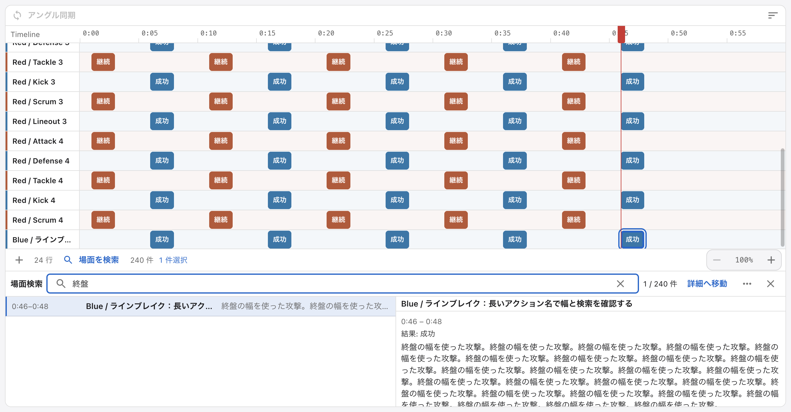
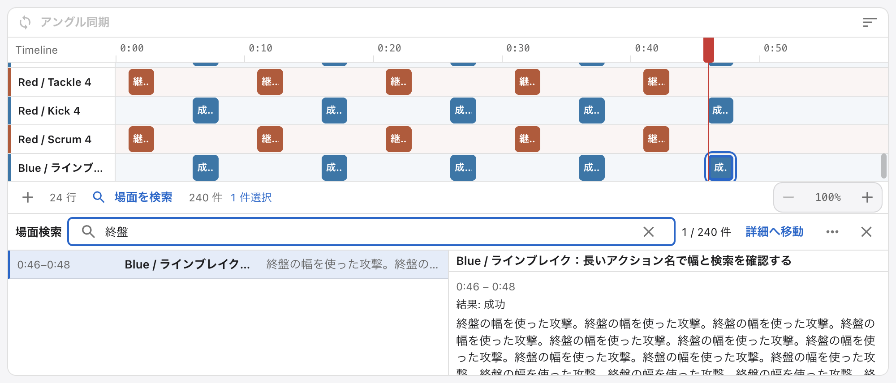
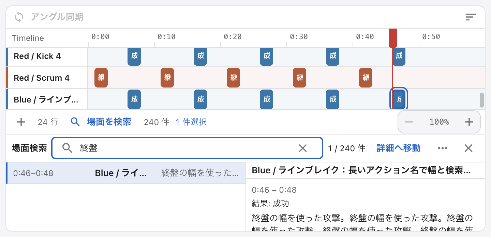
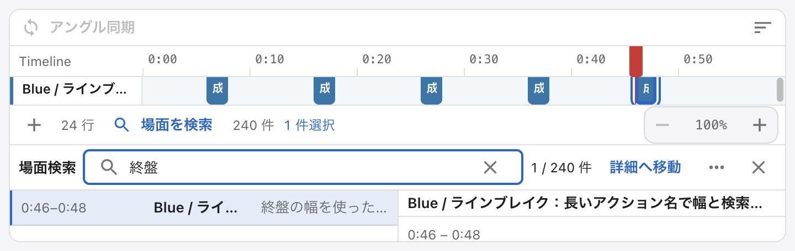

時間軸の横幅を保つ下部検索ドックと共通compactフォームの候補です。技術チェック成功と視覚受入を分けます。初回の最小画面はTimeline viewportが53pxで行が一部欠けたため、最新sourceでは軸＋完全な1行の最低60pxを確保する配分へ修正しています。その追加検証は未完です。

# SporTagLytics compact candidate — native evidence (2026-10-01)

Base draft PR189 head e9cd7092a441c2e98de9382be3b064fbc3fb8ad0. New candidate remains uncommitted. Mac Electron43.3, own ephemeral profile and synthetic60s H.264/24 rows240tags. No actual project/video/private paths included; original checkout and user data unchanged.

## Source correspondence

The completed native capture used the candidate built at17:20UTC: bottom dock, one-line search header, header pagination, action menu,112px timecode column,13px note text, shared small input/buttons/table/dialog density, sm/content-height basic wizard, viewport-bounded TimelineEditDialog, compact settings/dashboard/Playlist spacing. It still contained the <=600px stacked-results/detail branch, which is absent in the latest source. The completed captures are >=720px so that branch did not apply. The latest source further removes that branch, adds negative cases and60s bounded launch, and changes capture to finish finite transitions. These later changes have not completed native verification.

Initial candidate run completed4sizes and wizard→search→edit long-note cancel→Playlist inspector/save cancel→Hotkey settings. Full savedTimelineJSON remained unchanged. Subsequent2negative runs failed at electron.launch180s, after inspector websocket connected and before browser automation became available. No new UI functional failure was observed in those2runs. The earlier animation explanation was a tentative diagnosis before logs; launch timeout is the actual result. The old harnesses ended automatically; unrelated processes were not stopped.

## Measured bounds (CSS pixels)

| window   | old closed/open axis width | candidate closed/open axis width | candidate open axis height | typing stable | close restores bounds |
| -------- | -------------------------- | -------------------------------- | -------------------------- | ------------- | --------------------- |
| 1280x700 | 1262 /942                  | 1262 /1262                       | 361                        | yes           | yes                   |
| 1000x460 | 982 /662                   | 982 /982                         | 160.05                     | yes           | yes                   |
| 720x380  | 702 /hidden                | 702 /702                         | 118.45                     | yes           | yes                   |
| 720x260  | 702 /hidden                | 702 /702                         | 53                         | yes           | yes                   |

This keeps horizontal scale and some rows at the cost of visible rows. The smallest capture shows only a partially clipped row (53px viewport); the latest source now reserves at least60px for axis plus one complete row and needs native verification. It also has a short detail scroll area. This is a tradeoff, not a claim that minimum size is ideal for long review. User visual acceptance is pending.

Inputs changed38→32px high and14→13px text. Basic wizard dialog1200x711→600x348; package field1150→566px, team fields1150→277px each. Timeline edit dialog600x363→600x313, two-line note75→50px high. Playlist save dialog386x310→386x263. Dimensions are layout measurements, not user task completion timing or universal comfort evidence.

## Image selection

Four search images have been visually inspected. The Hotkey screenshot contains an indicator transition (General underline/Hotkey content) and remains preliminary; static recapture is required. Existing Library side-panel images remain unchanged for comparison. New wizard/TimelineEdit/PlaylistSave images were captured during Fade transitions (underlying content is visible through the dialog) and are excluded from visual evidence; their bounds are still recorded as measurements. Static representative dialog recapture is outstanding. No altered or reconstructed images are substituted.

## Outstanding checks

Unfiltered240items/6pages at88px dock;90minute+decimal timecode;599/600/601px component widths; short720x260 editor with invalid start/end, many labels, long note, Cancel/Save access; new action-menu Escape/keyboard focus; latest candidate22UX rerun; full unit/Storybook/Windows latest-head CI; dark mode/screenreader/OS IME/multiple monitors/long continuous work. Supported native minimum width remains720;599..601 checks temporarily lower only the harness window minimum to test responsive component boundaries. The long timecode fixture is display-only and never seeks beyond its60s synthetic video.

All known previous e9cd7092 technical gates passed, but they do not cover this new visual candidate. Mac heavy/native slot ended17:35UTC. No new full suite or release/main merge/tag is performed.

## Stable native images

Hotkey list and detail-name wrapping were revised after these captures. Updated static images remain pending. The final source now uses36px divider rows, wraps full action names, scrolls the focusable detail region, and reserves a minimum60px Timeline viewport; none is demonstrated by the earlier images.
