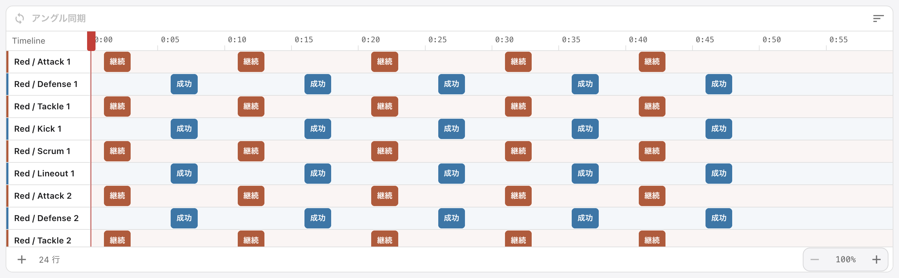
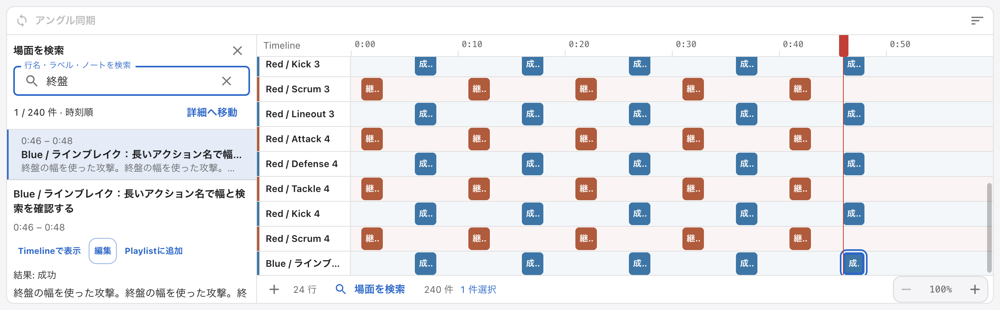
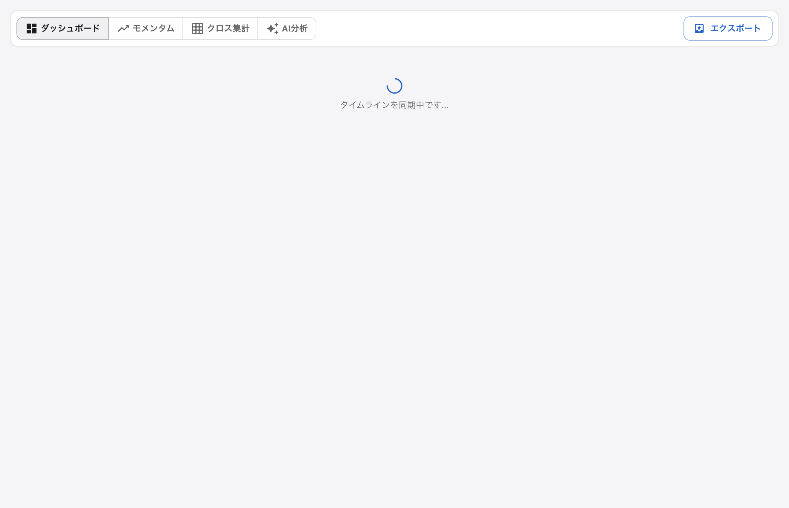
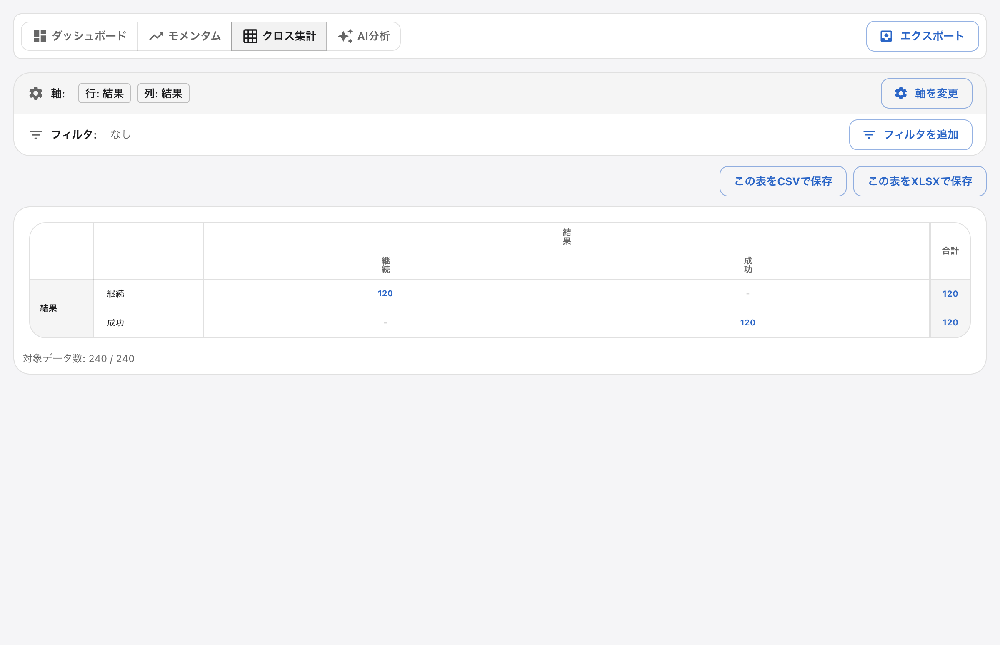

> 以下の初回評価・画像はe9cd7092の左panel版です。ユーザーの視覚レビュー後、下部dockと横断compact densityへ改修しています。[新候補の実測・画像・未完範囲](2026-10-compact-density.md)を参照してください。初回CI成功は新候補の完了を意味しません。

# SporTagLytics UX実機評価 — 2026-10-01

合成映像・架空のチーム/タグでMac版Electronを操作し、主要な作業のつながりを評価した。優先した改善は「記録した場面を探して、映像・ノート・編集・Playlistへ進むこと」、通常のキーボード移動、分析メニューの初期同期である。全用途で快適という結論ではない。人によるユーザビリティ調査や実試合での長時間運用は行っていない。

## 対象と前提

- 基準: `develop` の `3d744666`、アプリ設定 v0.17.1、実行Electron 43.3.0。通常の統合先はdevelop。独立clone/作業branchと専用user-data-dirを使用した。
- 元checkout、既存の映像/分析データ、通常のアプリ設定は変更していない。release・タグ作成・mainへの統合は行わない。
- 60秒のH.264テスト映像、24行/240件、長い行名、275字のノート、重なる区間、2種類の結果ラベルを使用した。既存E2Eは短い合成映像、2〜4角度、可変frame timestamp、fake camera/HTTP入力、同梱モデルを使用した。実試合の典型的な分布とは限らない。
- 1280×430のTimelineウィンドウと最小幅720・最小高さ260でも確認。スクリーンショットはrenderer領域で、OSタイトルバー/メニューバーは含まない。Retina画像の画素数とCSS寸法は異なる。
- 大きいbuild/全unitを複数同時に実行せず、全unitは最大2 worker・ファイル直列で実行した。終了対象は自分の専用検証プロセスのみ。

## 利用者と実在機能の棚卸し

| 利用者/目的                              | 操作の前提                         | 実在する機能と入口                                                                                 | 今回の確認                                                                                                                                                                                                                                             |
| ---------------------------------------- | ---------------------------------- | -------------------------------------------------------------------------------------------------- | ------------------------------------------------------------------------------------------------------------------------------------------------------------------------------------------------------------------------------------------------------ |
| 初心者: 初めて映像分析を始める           | ローカル映像と保存先を用意         | 開始画面、2段階作成wizard、パッケージ選択/drop、最近の履歴、オンボーディング、検索可能Help         | 空の開始画面・wizard表示/取消、file-dialog adapter取消、native open/drop、履歴再開、欠落パッケージのエラー→復元→再試行。作成IPCとメニューwizardは既存E2Eで確認。初心者本人による理解度は未測定                                                         |
| 現場アナリスト: 連続してタグを記録する   | Code Windowのボタン/キーと行を設定 | `.stcw`作成/保存/読込、アクション開始/終了、ラベル、独立Code Window、共通Timeline                  | 5区間の連続Coding、動画境界を跨ぐ区間、ホットキー、独立窓の連動、保存を既存Electron E2Eで確認                                                                                                                                                          |
| アナリスト: 動画を比較する               | 複数の動画/角度をパッケージ化      | 角度切替、clip配置、manual sync、signed offset、音声同期、最大8角度/各16clip                       | 4動画/2角度、隙間/角度欠落、同期配置、再生/seek/6倍速、設定キーの往復を既存E2Eで確認。最大構成と音声波形解析の品質は未確認                                                                                                                             |
| アナリスト: 記録を修正/再確認する        | Timelineにタグがある               | 行/範囲選択、ズーム/スクロール、drag編集、ノート/ラベル編集、Undo/Redo、今回の場面検索             | 24行/240件、長文、検索→映像seek→全文→編集取消/保存、通常Tab、空/一致なし/40件超ページ、狭幅と閉じるを実機確認。既存unitと再生E2Eで周辺操作を回帰確認                                                                                                   |
| コーチ: 特徴と根拠の場面を確認する       | ラベル/アクションの意味を決める    | 独立分析窓、Dashboard、Momentum、Matrix（クロス集計）、軸/フィルタ、CSV/XLSX                       | 分析メニューの初期同期とMatrix全240件を実機確認。Dashboardはラグビー前提が強く、他競技のfixtureで空の指標が残る。集計の戦術的妥当性・全軸/フィルタは未評価                                                                                             |
| コーチ: 説明用の映像を準備する           | Timelineから必要な場面を選ぶ       | Playlist Organizer/Sorter、ノート、Paint、角度/フリーズ、描画/映像export、`.stpl`                  | 今回の検索詳細→Playlistへノート引継ぎ。既存E2EでSorterの再生/並替え/Undo/Redo/保存再開、Paint seek・同期、実FFmpeg出力と日本語複数行ノートを確認。全描画ツールの精度/追尾品質は未確認。標準runnerで戦術盤の同梱モデル実行・部分校正・PNG・reloadも確認 |
| 分析担当: 保存して再開・データを共有する | `.stpkg`/`.stpl`と元映像を保管     | Timeline自動保存、履歴再開、native関連付け/drop、JSON/CSV/SCTimeline import/export、クリップexport | 保存後再起動→履歴→検索で同じノートと映像を再確認。Timeline JSON全体と動画相対パスをassert。Timeline/Playlist各export入口、出力動画の範囲/順序、保存再開は既存E2Eで確認。外部uploadは行っていない                                                       |
| 高度な用途: 自動化/ライブ                | モデルや機器を別途用意             | ローカルLLM、AI推奨clip、自動イベント検出、ライブcapture、設定                                     | Source/Helpで入口と前提を棚卸し。標準runnerでfake camera/HTTP入力・音声付収録・入力欠落時Coding、同梱モデルとイベント検出の機能経路を確認。推論精度と実機器の収録品質は未確認                                                                          |

既存のPlaylist Sorterには検索がある。しかし元のTimeline全体でノート/ラベルから場面を探す入口ではなく、Playlistへ追加した後の検索である。user-guideにあったTimelineのテキスト/チーム/アクションfilter記述は実UIに存在しなかったため、実装した検索に合わせて訂正した。

## 優先問題と修正

| 優先 | 観察・再現                                                                                                                                                     | 影響                                                                                                            | 実装/結果                                                                                                                                                                                                              |
| ---- | -------------------------------------------------------------------------------------------------------------------------------------------------------------- | --------------------------------------------------------------------------------------------------------------- | ---------------------------------------------------------------------------------------------------------------------------------------------------------------------------------------------------------------------- |
| 高   | パッケージ読込後、Window > 分析を開く。native側が直接窓を開き、初期snapshotが届かず「タイムラインを同期中です…」で止まる。別のrenderer経由の入口では表示された | 分析開始が入口によって失敗する                                                                                  | menuをそのパッケージのmain rendererへ送る既存経路に統一。Timelineなど補助窓からも所有パッケージへ送る。実機Matrix 240/240件、他文書へbroadcastしないunitを確認                                                         |
| 高   | 24行/240件に同じ結果ラベルが繰り返され、長い行名は省略、ノートはhover/編集から確認する。全文検索の入力欄はない                                                 | 知っているノートの語から場面へ辿れず、目視走査とhoverに依存する。重なる区間では見えているバーと全件は一致しない | 開閉式レビュー欄に行名/ラベル/ノートのAND検索、時刻順40件ページ、件数、映像seek、全文詳細、既存の編集/Playlist追加をまとめた。文書/書き出し対象は絞らない                                                              |
| 中   | タグ選択後にTab。既存の同一アクション巡回がpreventDefaultし、選択だけが変わってDOM focusは元のタグに残る                                                       | キーボードで他の操作へ移れず、選択とfocusが食い違う                                                             | 通常Tab/Shift+Tabを復元。同一行巡回はOption/Alt+上下を維持。タグのaccessible nameへ行名・時刻・ラベルを含め、focus-visible輪郭を追加                                                                                   |
| 中   | 検索を常設すると、短いTimeline窓の行表示が減る。狭幅で左右に2面を残すと窮屈になる                                                                              | 現場Codingの既存密度とコーチの詳細確認が競合する                                                                | 既定は閉じ、既存フッターに入口。広幅は左320px、編集領域880px以下ではレビュー/Timelineを切り替える。検索/閉じるを固定表示し、×/レビュー内の空欄Escで閉じ、入口へfocus復帰。閉じた後のTimeline高さは308 CSS pxで変化なし |

検索関数、状態hook、props-only Viewへ分離した。[ADR 0055](../adr/0055-timeline-review-without-document-filtering.md)と[操作仕様](../timeline-review.md)に判断と動作を記録した。色/境界/タイポグラフィは既存themeを使用している。

## 比較画像

すべて架空データ。beforeは基準commit、afterは最終実装。検索のbefore/afterは同じ行名・件数・ラベル構成を用い、afterは目的の場面46秒へ移動した状態である。

| Before: Timelineに検索入口なし                             | After: 語から映像と全文詳細へ                                    |
| ---------------------------------------------------------- | ---------------------------------------------------------------- |
|  |  |

| Before: 分析が初期同期で停止                                   | After: 同じmenu入口から全件を集計                           |
| -------------------------------------------------------------- | ----------------------------------------------------------- |
|  |  |

その他の状態: [閉じた既定画面](assets/2026-10-ux/timeline-closed-after.png)、[最小幅の検索](assets/2026-10-ux/timeline-compact-after.png)、[一致なし](assets/2026-10-ux/timeline-no-match-after.png)、[タグ0件](assets/2026-10-ux/timeline-empty-after.png)、[最小高さで詳細へscroll](assets/2026-10-ux/timeline-min-height-after.png)。最小高さで検索/閉じるがscroll外へ消えた指摘を受けて固定表示に修正した。長文詳細は折り返しとスクロールで確認できるが、720×260で一度に見える量は少なく、長文には縦に広げる操作を勧める。画像は全文を一度に表示した証拠ではなく、E2Eで全文の存在と編集保存を確認している。

## 操作負担と証拠の区別

- ノート語が既知のケース: 従来は検索操作がなく、行scrollと個別hover/編集による走査が必要だった。240件のfixtureで最悪240件を検討し得るが、人が実際に240回hoverしたという測定ではない。修正後は`Cmd+F → 終盤を入力 → Enter`の3段階で1/240件へ絞って46秒へ移動した。
- 検索確定からmain videoのcurrentTimeが46秒に到達するまで: 初回89ms。いずれもこのMacの合成データでの単回値で、統計的benchmark・一般性能保証・操作全体の時間ではない。run間の比較による性能改善率は算出していない。
- 40件超: 空検索で全240件、6ページ。次/前ページを操作でき、hook unitで85件→3ページ、検索変更/データ減少時のページclampと選択消失を確認。
- 閉じる: ×と空検索Escをそれぞれ実操作。Esc後はフッター入口がactiveElement。再度開ける。閉じた後の行領域高さ308pxをassertした。最小720×260ではレビュー全体もscrollでき、編集ボタンへ到達してから閉じられることを確認した。
- 取消: 作成wizardのEsc、native file-dialog adapterのcancel、ノート編集のキャンセルを別々に実行。編集取消後はノート全文だけでなく保存JSON全体も変更なし。
- 該当なし: 検索語・0件案内・検索をクリアする操作を表示。空検索とは別の状態を撮影した。
- タグ0件: 同じ合成パッケージをタグ0件にした専用runでCode Windowへの案内を撮影。該当なしとは文言を分ける。
- Keyboard: 選択タグでTab後にfocusが移動することを実機assert。Cmd+FとEnter/Escを操作。`isComposing`付きイベントで日本語変換中のEnter/Escが検索確定/クリアをしないことを確認したが、OSの実IME操作そのものは未確認。
- 保存再開: ノート1件だけを編集し、保存JSONが期待した全文と一致することを確認。アプリ終了/再起動→履歴→検索→同じノート、実video readyState、`synthetic.mp4`再生元、angle/clipの相対パスを確認。検索/選択は保存JSONを変えない。
- エラー回復: 専用パッケージを一時移動して履歴から開く→エラー案内→元へ戻す→「もう一度開く」→動画とTimelineが復帰。実データや外付けドライブを使用していない。

## 検証と再現

typecheck（renderer/Electron）、lint、architecture、design-system、ADR、renderer build、Electron main/preload buildとpreload check、Storybook buildが成功した。全unitは214ファイル/705テストが成功した。補助窓menu回帰とWindows/POSIXの履歴名回帰を含む。Windowsの初回新UXシナリオは再起動後の履歴名で失敗し、登録時にbackslashをbasenameへ分割していなかった既存不具合を修正した。buildの既存chunk-size警告は残る。

| Electron実行                          | 結果/対象                                                                                                               |
| ------------------------------------- | ----------------------------------------------------------------------------------------------------------------------- |
| `scripts/e2e-ux-review.mjs`           | 22項目。検索、映像seek、全文、文書不変、ページ、focus、狭幅、編集、Playlist、分析、保存再開、動画path、欠落回復、空タグ |
| `scripts/e2e-code-window-menu.mjs`    | native menu、作成wizard、Code Window作成/保存/選択、設定preload、検索可能Help。live capture窓を開くところまで           |
| `scripts/e2e-multi-clip-playback.mjs` | 4動画/2角度、再生/seek/6倍速、5Coding区間、同期、独立Code Window、Playlist/Paint、映像出力                              |
| `scripts/e2e-export-menu.mjs`         | main/Timeline/Playlist各入口、実FFmpeg、Sorter順序、Undo/Redo、save/reopen、ノート、export overflow案内/回復            |
| `scripts/e2e-package-reopen.mjs`      | native directory drop、did-finish-load時のopen、close→external/recent/drop/dialog再開、所有窓の終了                     |

新しい縦断検証は既存runnerへ登録した。`scripts/run-electron-e2e.mjs`の全18シナリオを直列実行し、新UXの22項目を含む17シナリオが成功した。既存`angle-sync-multi`のみ3角度の補助video seek待ち15秒でtimeoutし、同じbuildの単独再実行では3/4角度・VFRとも成功した。一括実行を全18成功とは記載せず、seekの安定性は横断監査の残課題とする。初回一括実行では新UXの保存pollが書込途中のJSONを読み失敗したため、SyntaxErrorのみ期限内に再読込するharnessへ修正し、最終JSON全体の一致assertは維持した。次で単独再現できる。対応するFFmpeg/ffprobeとローカルモデルassetsが必要である。検証専用のtempパッケージとuser-data-dirを生成する。Finder/Explorerの画面は操作せず、native dialog APIはadapterで選択/取消する。

```bash
pnpm run e2e:prepare
E2E_SCREENSHOT_DIR=output/playwright/ux-review node scripts/e2e-ux-review.mjs
```

レビュー仕上げでは、結果外の選択詳細だけを消し文書選択を維持、対象行/時刻へのrevealと「Timelineで表示」、詳細skipとnote/labelのaccessible description、閉じた状態の検索計算停止、dialog/IMEを守るレビューEscも回帰確認する。

Storybook: `Workspace/Timeline/Review` のManyAndLongNote / Empty / NoMatches / Compact。機械テストのpassを快適さの証明とは扱わず、画面の密度・読める範囲・実際の操作経路を別に確認した。

## 残課題・未確認範囲

- Dashboard/Code Window初期設定のラグビー用語と指標が他競技に合うか。空の指標から設定へ導く案内は改善余地がある。本変更では競技templateの全面変更を行っていない。
- 重なるTimelineバーの直接選択や密集データの見通し。検索は別経路を提供するが、重なり自体のレイアウトは変更していない。検索結果の一括編集/一括exportも未実装。
- 1万件以上、数時間映像、最大8角度/16clip、multi-monitor、Retina以外、Windows/Linux、dark modeの実機、screen reader、OS IME、ドラッグ機器/trackpadの全操作、長時間CPU/メモリ/発熱は未確認。検索計算は全件に比例する。
- AIモデル推論とイベント検出の精度、音声解析品質、YouTube/ネットワーク、実camera capture、外付け切断、権限拒否/ディスク満杯、全import形式と他社とのround-tripは未確認。新しいモデル/資格情報は取得していない。
- cloudWebではnative窓のownership、動画decode、native menu、file dialog、FFmpeg出力、パッケージ関連付けを代替検証できない。今回はMac Electronでこれらの一部を確認したが、署名済み配布app・インストーラは作成していない。

## 依存セキュリティ（UX修正と別件）

Electron 43.3.0は公表済みGHSA-qmv3-fv6v-rmhqの範囲に入る。[Electron一次情報](https://github.com/electron/electron/security/advisories/GHSA-qmv3-fv6v-rmhq)は43.4.2を修正版、[GitHub集約advisory](https://github.com/advisories/GHSA-qmv3-fv6v-rmhq)は43.5.0を修正版としており記載が異なる（確認時点）。一次情報はuntrusted contentを読込むappが対象としている。

この調査ではローカル合成映像のみを使用し、外部YouTube/不審コンテンツを開いていない。contextIsolation/sandbox/webSecurityとnavigation拒否を維持した。依存upgrade・配布はこのUX変更へ含めておらず、修正版選定と配布前のsecurity回帰は別作業として残る。

参照した操作設計の根拠: [Apple HIG: Keyboards](https://developer.apple.com/design/human-interface-guidelines/keyboards)、[Accessibility](https://developer.apple.com/design/human-interface-guidelines/accessibility)。通常focus移動、明確な選択/focus、発見できる基本操作を既存アプリの実測問題に対応させた。
